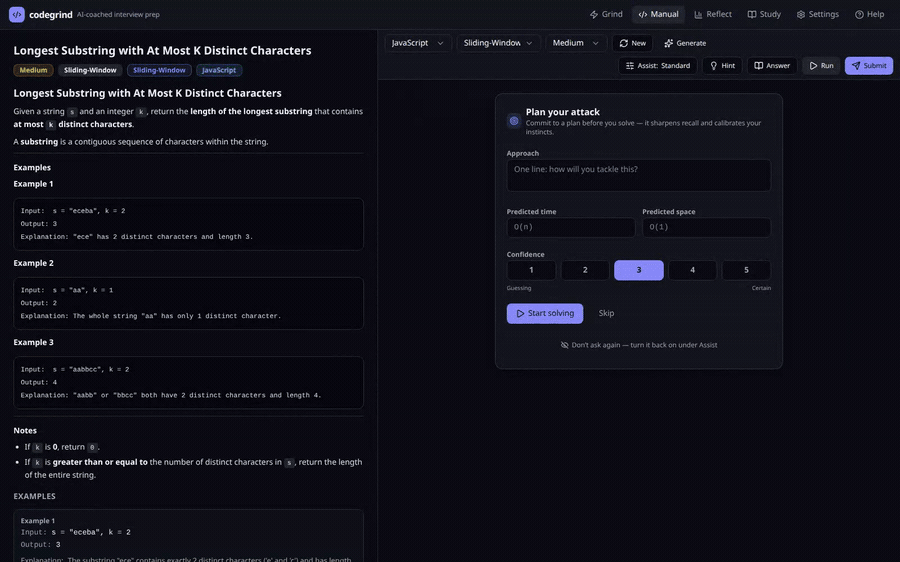

# codegrind

An AI-coached interview-prep trainer that runs on your own machine. It writes you a
problem, **proves the problem is solvable before it serves it**, runs your answer in a
locked-down container, and then tells you what you actually did wrong — not "wrong
answer", but which pattern you missed and what your complexity really was.

One user, one SQLite file, no accounts and no cloud. Every model call is one you
triggered, so an idle instance costs nothing. Point it at Claude, or at a model you
already run yourself — in which case there is no API key anywhere in the system.

MIT licence · Node 20 or 22 · Docker · SQLite · JavaScript, Python and Go

<!-- SCREENSHOT SLOT — replace with a GIF of one full grind loop:
     the served problem and its intent line ("reinforce: sliding-window,
     medium"), typing a solution, Run going green on the samples, Submit, and
     the coaching brief arriving underneath the results. ~15s, no audio.
     Drop the file at docs/images/grind-loop.gif, then delete the two comment
     markers below to publish it. It stays commented out until the file exists,
     because a broken image is worse than no image on a public front page. -->

<!--

-->

---

## Why this is not a chat window with a code box next to it

**The model does not get to decide what the right answer is.** Every generated problem
ships with a reference solution, and that reference is *executed in the sandbox* before
the problem is stored. Its output becomes the `expected` value for each test. Tests the
reference errors on are dropped; a problem with too few survivors is thrown away and
regenerated. This exists because of one specific and extremely common model failure — a
perfectly correct reference paired with hand-authored expected values that disagree with
it. A problem stored that way is unsolvable, is served silently, and fails in the one way
you cannot diagnose, because it looks exactly like your own mistake. Running the
reference makes the problem self-consistent by construction. It is also why a fresh
generate takes 15–30 seconds rather than 5: you are paying for two extra sandbox runs.

**It runs on hardware you own, for free.** Claude, or any OpenAI-compatible endpoint —
llama.cpp, llama-swap, vLLM, Ollama, LM Studio — with **no API key at all** in the normal
local case. The setup wizard does not take your word for it: it fires one real forced
tool call at the model you picked, times it, and refuses to store a model that answers in
prose instead. Ten of this app's eleven model calls are forced tool calls, so that is the
only check worth running.

**It remembers you, which is the thing a chat window cannot do.** An 18-topic skill tree
with a real prerequisite graph. A tier ladder where one credit is *one distinct problem
solved with zero hints* and three credits clear a tier. Spaced repetition per topic. And
a review queue that re-serves the exact problem you needed help on, days later, **cold** —
same problem, no variation, Hint button gone.

**It coaches the pattern, not the answer.** The brief after a submit names the pattern you
should have recognised, puts your complexity next to the optimal, and gives you one thing
to fix. There is a predict-before-solve gate that takes your stated approach and
complexity up front, so the coach can compare what you *thought* your code did against
what it demonstrably did.

**Nothing runs when you are not there.** No background jobs, no warming, no timers. And
the scheduler that decides which problem you see next — the part that runs on every
single problem — makes **zero** model calls. That is what lets it be adaptive per problem
without being expensive per problem.

"Show me the answer" is always available and never refused. It is recorded rather than
blocked: a revealed problem simply earns no tier credit.

---

## Quickstart

```
git clone git@github.com:Hexidecibel/codegrind.git
cd codegrind
bin/setup
```

That is the whole thing. There is no file to edit first — no `.env` to fill in, no API key
on disk. `bin/setup` checks what it needs, installs, builds, migrates, builds the sandbox
images, starts the server, and tells you where to go:

```
codegrind setup  /home/you/src/codegrind

  ✓ node v22.22.0
  ✓ docker 29.1.3
  ✓ disk 540 GB free on /var/lib/docker
  ✓ .env written (port 9416, data /home/you/src/codegrind/data)
  · installing dependencies (npm, a minute or two the first time)…
  ✓ dependencies installed
  · building the client (typecheck + bundle; Monaco makes this the slow part)…
  ✓ client built
  · preparing the database…
  ✓ database ready — schema v3, 0 problems, 0 attempts, 0 lessons, 0 settings
  ✓ runner images: javascript python go (already done)
  · starting the server…
  ✓ listening on http://localhost:9416

  → open http://localhost:9416 to finish setup
    It will ask which model should write your problems, then stock the bank.

    bin/status  how it is doing      bin/stop   stop the server
    bin/logs    tail the log         bin/setup  safe to run again
```

On a machine that has not built the sandbox images before, that images line instead reads
`· building sandbox images: javascript python go (first time only; several minutes)…` and
takes a few minutes. The three finished images measure about 650 MB together; `bin/setup`
insists on 3 GB free because the build needs layer scratch on top. A re-run afterwards
skips everything unchanged and finishes in about half a second — it is meant to be re-run.

The browser then walks you through three steps and a summary: **pick who writes the
problems**, pick a language, optionally stock the bank with 8 starter problems — then a
Ready screen naming the two models you just chose, which drops you into a live session.
The first step is skipped entirely when the install can already work.

```
bin/setup                 # everything, then start the server
bin/setup --port 9500     # bind somewhere else (writes it to .env)
bin/setup --no-start      # prepare everything, start nothing
bin/setup --force         # redo the install and the build even if unchanged
bin/setup --check         # preflight only: report, change nothing
```

### What you need first

| | |
|---|---|
| **Node 20 or 22** | **Not Node 24.** `better-sqlite3` is ABI-pinned and hard-crashes under it. `bin/setup` detects this and tells you what to run. |
| **Docker** | Daemon reachable, and your account in the `docker` group — that group is root-equivalent on the host, so read [Security](#security) before you add yourself to it. There is no fallback that runs your code in-process. |
| **~3 GB free disk** | Where Docker stores images. The finished images are about 650 MB; the rest is layer scratch during the build. `bin/setup` hard-stops below 3 GB and warns below 6. |
| **A free port** | 9416 by default. `bin/setup --port 9500` moves it. |
| **Something to write the problems** | An **Anthropic key** *or* an **OpenAI-compatible endpoint** you already run. Asked for **in the browser**, not before `bin/setup`. A key is stored in the database, never in `.env`; a local endpoint usually needs no key at all. |

Nothing else. No secret manager, no external services.

### Which model writes your problems

The first wizard screen offers two paths, and neither of them is a text box you can get
subtly wrong.

- **Claude.** Paste an Anthropic key. It is checked against Anthropic with a `models.list`
  call — which costs nothing and is the only thing that distinguishes a typo from a
  revoked key — and then kept in this machine's SQLite database, never in `.env`. Best
  quality; a few cents an hour.
- **Your own model.** Type the base URL including the `/v1` segment, press Models, and
  pick from what that server actually advertises in `GET /v1/models`. No key in the normal
  case; there is a collapsed field for the rare endpoint behind a gateway that wants a
  bearer token. Slower, and free.

Either way the choice is *proved before it is stored*, and the two paths prove different
things because different things go wrong. The local path gets the harder test: a genuine
forced tool call against the model you picked, timed, so the screen can tell you roughly
how long one generated problem will take. A model that answers in prose is refused right
there with a message naming the likely fix — usually llama.cpp started without `--jinja` —
rather than failing three screens later inside a 30-second generate. Nothing is stored
when the check fails.

Two roles are routed independently: the **workhorse** (generation, hints, session plans,
primers, lessons, coaching) and the **tutor** (the chat behind `POST /api/ask`). The tutor
defaults to matching the workhorse's *provider*, so a local install stays local and no
bill appears that nobody agreed to. On the Claude path the two models differ on purpose —
the coach runs on the larger one, because that is one call per question you actually ask.
There is no failover: an endpoint that is down fails loudly and names itself, rather than
quietly becoming a Claude call. All of it is changeable later from **Settings**, and a
deploy can pin any of it from the environment.

---

## The daily loop

Three tabs are the loop.

**Grind** — the main event. Press start and the app plans a sitting, then serves one
problem at a time. It picks each one from an intent — `warm-up`, `reinforce`, `variation`,
`level-up`, `new-pattern` or `review` — and tells you which and why. You write code, hit
Run against the sample tests (free, no model call), then Submit against the hidden tests,
which grades you, records the attempt, and streams back a coaching brief. Ask follow-up
questions inline. Hidden expected values are stripped on the wire, not merely hidden in
the UI.

**Study** — a reading track alongside the grind: lessons and pattern primers ordered
against your actual mastery, including slots generated from your own recurring mistakes.
Lesson prose is shared across languages; only the code snippets are translated.

**Reflect** — what you have actually done. Skill tree, tier ladder, mistake ledger, an
84-day activity heatmap and trend charts.

(**Manual** lets you pick a topic and difficulty yourself. **Settings** shows how you are
currently routed and lets you change it. **Help** is the in-app manual.)

---

## Languages, and one idea

> **Language is a property of the problem, not of the submission.**

A problem's `expected` values were produced by running its reference solution, so its test
data is bound to the language that produced it. Therefore `POST /api/run` and
`POST /api/submit` carry only `{problemId, code}` — no language. The server reads
`problem.language`. Handing Python source to the JavaScript harness is not unlikely, it is
*unrepresentable*.

The bank, your skill state, tiers, unlocks and review queue all fork per language and
start cold, deliberately: a tier means three distinct problems solved at that difficulty
with zero hints, and you have not done that in Go. Your streak and lessons-read count stay
global. Nothing is deleted by switching, and switching changes what gets served **next**,
never what is on screen.

**JavaScript, Python and Go are wired up end to end. Java is not.** It is in the language
registry and has no `test-harness/java/`, so nothing could run a Java submission — and so
it is offered nowhere a language can be chosen. The wizard, both pickers, `PUT
/api/settings` and `POST /api/setup/seed` all derive that from the harness directory not
existing rather than from a list somebody maintains, which means the day the harness lands
they all start offering it with no further edit. See
[docs/adding-a-language.md](docs/adding-a-language.md) for what finishing it involves.

---

## Security

Read this before you run it, and especially before you put it anywhere.

**codegrind is single-user and has no authentication of its own.** There are no accounts,
no login and no session cookie — the API is open to whoever can reach it. `HOST` defaults
to `127.0.0.1` and it should stay that way. **Do not set `HOST=0.0.0.0`** and do not
publish it on a network unless you have put your own authentication in front of it; the
one deployment that is exposed sits behind a separate gate at the reverse proxy. A
loopback bind is also not the whole story: it keeps other *machines* out, but every
browser on your own machine is already inside it, which is why the shipped cross-origin
policy refuses foreign origins outright rather than merely withholding response headers.

**Your code is contained.** Every submission — yours, and the runs the app does to verify
its own problems — executes in a throwaway Docker container with no network, a read-only
root filesystem, all capabilities dropped, `no-new-privileges`, a memory cap, a PID cap, a
CPU cap and a hard external timeout. There is no fallback that runs submitted code in the
server process. An infinite loop is a non-event: the timeout kills the container and you
get a `timeout` verdict. This is genuinely the point of the design, and it is why the
sandbox is a hard requirement rather than an option.

**But containment is not virtualization.** A container shares the host kernel. Treat this
as protection against your own runaway loops and against a generated reference solution
doing something silly — not as a place to detonate hostile code you were handed.

**Running it requires Docker-group membership, which is root-equivalent on the host.**
`bin/run-submission` never prefixes `sudo` and cannot: it is spawned from the server
process with no TTY, so a password prompt would have nobody to answer it. The account
running the server has to reach the Docker daemon directly. That is a real privilege grant
and worth a deliberate decision, not a copy-paste.

---

## Architecture, briefly

```
browser (React + Vite, Monaco on desktop / CodeMirror on mobile)
   │  fetch /api/*
Hono server (single process, tsx)
   │
   ├── scheduler.service   free, deterministic: what to serve next
   ├── llm.service         generate, coach, hint, plan, lessons — says WHAT it wants
   │    └── llm.client     …and this is the only file that knows WHO answers:
   │                       Anthropic, or an OpenAI-compatible endpoint
   ├── bank.service        generate → canonicalize → store
   ├── sandbox.service ──► bin/run-submission ──► docker run --network none --read-only
   └── db.ts               one SQLite file, WAL
```

A language is described in four places, each owning a different kind of fact —
`src/shared/languages.ts` (presentation), `bin/lib/languages.sh` (Docker),
`src/server/services/llm.language.ts` (prompts), `test-harness/<lang>/` (the harness).
`src/shared/languages.test.ts` is what makes a half-added language fail loudly.

Read next:

- **[docs/how-it-works.md](docs/how-it-works.md)** — the conceptual guide, and the place to
  start. How a problem is written and then *verified*, how the scheduler picks without
  spending anything, what the sandbox enforces, what a submit actually does, and what each
  of those costs.
- **[docs/architecture.md](docs/architecture.md)** — the code map: the request path, the
  LLM seam, the data model, how `settings` works, the client structure.
- **[docs/operations.md](docs/operations.md)** — every `bin/` script, backups and restores,
  migrations, systemd.
- **[docs/troubleshooting.md](docs/troubleshooting.md)** — the failure modes and their
  fixes.
- **[docs/adding-a-language.md](docs/adding-a-language.md)** — the contract for a fourth
  language, as a checklist.

## Development

```
export PATH="$HOME/.nvm/versions/node/v22.22.0/bin:$PATH"   # or nvm use 22
npx vitest run       # the whole suite: no database, no network, no docker
npx tsc -b           # typecheck
bin/build            # typecheck + bundle + precompress into dist/
```

The suite is hermetic, and that is a property rather than a habit: nothing in it imports
`db.ts` at module scope against the live database, nothing calls a model, nothing runs
Docker. It is fast enough to run on every save — and it is also why it proves nothing
about the sandbox images. That is what `bin/build-runner-image --selftest` and the
`bin/smoke-*` scripts are for; an image that disagrees with the shared equality fixture is
deleted rather than published.

### Three rules for contributors

1. **Every language-partitioned db accessor takes `language` as a required, leading,
   non-defaulted parameter.** An optional one would turn every missed call site into a
   silent cross-language read that looks perfectly correct on a JavaScript-only machine.
   Required means a missed site is a compile error. (`getProblem(id)` is the exception —
   the id carries its own language.)
2. **The API key never goes in `.env`.** See
   [docs/troubleshooting.md](docs/troubleshooting.md).
3. **Never put the database on mergerfs, NFS or NTFS.** SQLite's locking breaks there and
   it corrupts. NVMe/ext4 only.

## Licence

MIT. See [LICENSE](LICENSE).
